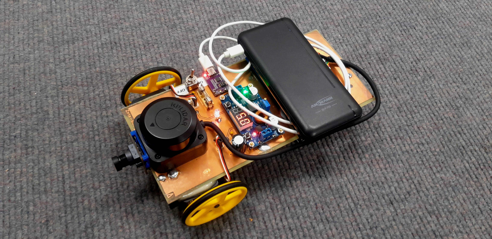

# The Zeta-bot

What is the Zeta-Bot?

The Zeta-Bot is an open-source robot platform that uses the:

 - Raspberry PI 5 + active cooling fan
 - [Parallax's Continuous Rotation Servo Motors](https://www.parallax.com/product/parallax-continuous-rotation-servo/),
 - [C1 LIDAR](https://www.slamtec.com/en/c1),
 - [OV9281 global shutter camera](https://www.inno-maker.com/product/cam-mipi9281raw-v2/)
 - [LSM6DSOX Gyro/Accelerometer](https://github.com/berndporr/LSM6DSOX_RPi)
 - [a standard mobile phone 1700mAh power bank](https://uk.rs-online.com/web/p/power-banks/2498449),
 - [Pimoroni NVMe Base M.2 PCIe](https://shop.pimoroni.com/products/nvme-base?variant=41219587178579)

This is an ongoing project to provide the hardware 
for research in robotic planning.

## Hardware

The KiCad design files and BOM are in [hardware](hardware).

## Software

 - Motor control libraries: [wheeleddrive](wheeleddrive).
 - Camera driver: https://github.com/berndporr/libcamera2opencv with a demo to display the camera image.
 - LIDAR driver: https://github.com/berndporr/c1lidar
 - [LSM6DSOX Gyro/Accelerometer](https://github.com/berndporr/LSM6DSOX_RPi)

## Credits

 - (c) 2026, Bernd Porr, mail@berndporr.me.uk
 - (c) 2025, Saleh AlMulla
 - (c) 2025, Yixuan Zha
