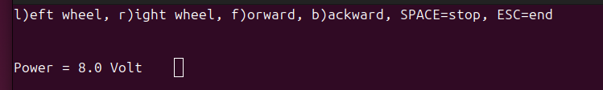

# C++ ZetaBot API for the Raspberry PI

Add to `/boot/firmware/config.txt`:

```
dtoverlay=pwm-2chan
```

and reboot.

Check with:

```
pinctrl -p
```

that you see:

```
12: a3    pd | lo // GPIO18 = PWM0_CHAN2
35: a3    pd | lo // GPIO19 = PWM0_CHAN3
```

which corresponds to the sysfs files:

```
/sys/class/pwm/pwmchip0/pwm2: GPIO18 
/sys/class/pwm/pwmchip0/pwm3: GPIO19
```

### libgpiod

The GPIO pins are accessed via the C++ API of the `libgpiod`:

```
apt-get install libgpiod-dev
```

### ncurses
The demo programs below display the sensor
readings with the ncurses library. Install
it with
```
apt-get install libncurses-dev
```

## Building

The built system is `cmake`. Just type:
```
cmake .
make
sudo make install
```

## Usage

The online documentation is here: https://berndporr.github.io/alphabot/

### Start/stop

Start the callback reporting the battery voltage.
```
start()
```

Stop the callback.
```
stop()
```

### Motor speed

Setting the speeds of the left/right wheels:
```
setLeftWheelSpeed(float speed);
setRightWheelSpeed(float speed);
```
where speed is between -1 and +1.

### Callback

There is a callback which reports the battery voltage.

## Demo programs



`testIO` is a simple test program which displays the battery voltage and you can test the motors. It also shows
how the callback is used to display the battery voltage.

`testMotor` ramps up the motor speed and back again.
